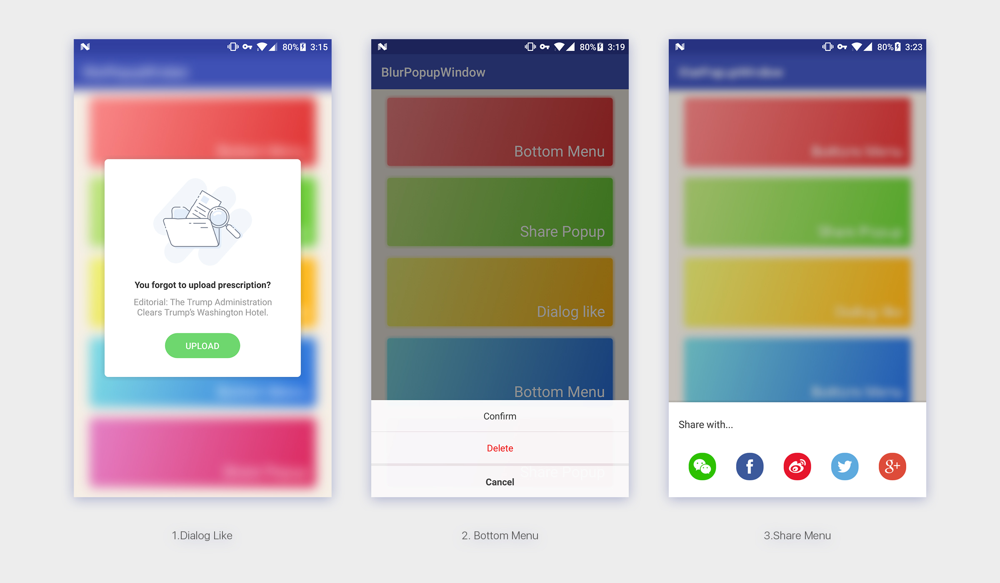

# BlurPopupWindow

**BlurPopupWindow** is not actually a sub-class of PopupWindow. But we did run into some requirements that display a popup in current page with blurred background. Or you may want to display a custom dialog and you are in trouble with the difficulty and diffrent-result through different sdk version and roms. **It is possible to just put a simple custom View in current Window and do not bring that lots of other things in?** 

**BlurPopupWindow** is more like a pattern to implement these custom popup windows. By default BlurPopupWindow contains nothing but a blurred background. You need to, **and actually this is just you want**, design all the content and maybe custom the animation.




### Features

* Blur/Not blur background.
* Support translucent status bar and translucent navigationbar.
* Tint color.


### Use with Gradle

```groovy
dependencies {
    compile 'com.kyleduo.blurpopupwindow:blurpopupwindow:1.0.4'
}
```


### Usage

A typically usage would be like this:

```java
new BlurPopupWindow.Builder(v.getContext())
        .setContentView(R.layout.layout_dialog_like)
        .bindClickListener(new View.OnClickListener() {
            @Override
            public void onClick(View v) {
                Toast.makeText(v.getContext(), "Click Button", Toast.LENGTH_SHORT).show();
            }
        }, R.id.dialog_like_bt)
        .setGravity(Gravity.CENTER)
        .setScaleRatio(0.2f)
        .setBlurRadius(10)
        .setTintColor(0x30000000)
        .build()
        .show();
```

And this would display a dialog-like popup window like**(1)**. The content display depends on you layout design.

The blur effect is not that necessay and you can disable it by setting the `blurRadius` to `0`. And you got**(2)**

Or you can tune the blur effect to what you want, like **(3)**.


### Builder

The Builder class has some methods for change the behavior. Most of them are easy to understand by their name.

```
builder
.setContentView(resId)
.setContentView(view)
.setGravity(Gravity.CENTER)
.setScaleRatio(0.2f)
.setBlurRadius(10)
.setAnimationDuration(300)
// draw a color over background to dim, lighten, or coloring the background.
.setTintColor(0x30000000)
.setDismissOnClickBack(true)
.setDismissOnTouchBackground(true)
// bind click listener to id1, id2, ...
.bindClickListener(listener, id1, id2, ...)
// bind click listener to content view
.bindContentViewClickListener(listener)
```


### Customize

As I mentioned before, BlurPupupWindow does not contains any content view. so you need to create one.

The suggested way to customize a content is to create a class extends from BlurPopupWindow. And there are some methods for you to override. The source code of 3rd demo above would be like this.

**There are some points you need to know:**

* Create Builder class exten BlurPopupWindow.Builder and set generic type to your class.
* In Builder class, override createPopupWindow method and return corrent instance.
* You can override `onShow()`/`onDismiss()` to add your own animation.
* `createShowAnimator()`/`createDisAnimator()` return alpha animation by default, override them and return null if you do not like that.

```java
public class SharePopup extends BlurPopupWindow {

	public SharePopup(@NonNull Context context) {
		super(context);
	}

	@Override
	protected View createContentView(ViewGroup parent) {
		View view = LayoutInflater.from(getContext()).inflate(R.layout.layout_bottom_popup, parent, false);
		LayoutParams lp = new LayoutParams(ViewGroup.LayoutParams.MATCH_PARENT, ViewGroup.LayoutParams.WRAP_CONTENT);
		lp.gravity = Gravity.BOTTOM;
		view.setLayoutParams(lp);
		view.setVisibility(INVISIBLE);
		return view;
	}

	@Override
	protected void onShow() {
		super.onShow();
		getContentView().getViewTreeObserver().addOnGlobalLayoutListener(new ViewTreeObserver.OnGlobalLayoutListener() {
			@Override
			public void onGlobalLayout() {
				getViewTreeObserver().removeGlobalOnLayoutListener(this);

				getContentView().setVisibility(VISIBLE);
				int height = getContentView().getMeasuredHeight();
				ObjectAnimator.ofFloat(getContentView(), "translationY", height, 0).setDuration(getAnimationDuration()).start();
			}
		});
	}

	@Override
	protected void onDismiss() {
		super.onDismiss();
		int height = getContentView().getMeasuredHeight();
		ObjectAnimator.ofFloat(getContentView(), "translationY", 0, height).setDuration(getAnimationDuration()).start();
	}

	@Override
	protected ObjectAnimator createShowAnimator() {
		return null;
	}

	public static class Builder extends BlurPopupWindow.Builder<SharePopup> {
		public Builder(Context context) {
			super(context);
			this.setScaleRatio(0.25f).setBlurRadius(8).setTintColor(0x30000000);
		}

		@Override
		protected SharePopup createPopupWindow() {
			return new SharePopup(mContext);
		}
	}
}
```


License
---

```
Licensed under the Apache License, Version 2.0 (the "License");
you may not use this file except in compliance with the License.
You may obtain a copy of the License at

   http://www.apache.org/licenses/LICENSE-2.0

Unless required by applicable law or agreed to in writing, software
distributed under the License is distributed on an "AS IS" BASIS,
WITHOUT WARRANTIES OR CONDITIONS OF ANY KIND, either express or implied.
See the License for the specific language governing permissions and
limitations under the License.
```

